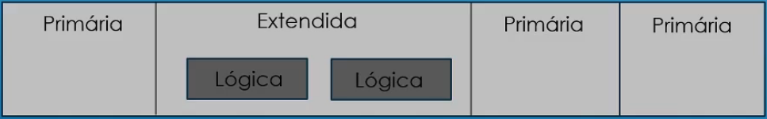

## 102.1 Design do Layout do HD - Conceitos: Partição, Ponto de Montagem, FS MBR

Particionamento: Dividir o disco em partes (sda1, sda2, sda3)
Ponto de Montagem: Associar essa partição a um diretório do Linux (/, /home, /usr), swap.

**Vantagens do Particionamento**
* Gerenciamento de espaço em disco;
* DIferentes tipos de FileSystem para cada partição;
* Proteção contra erros do disco;
* Diferentes níveis de segurança;
* Backup facilitado;

**Sistemas de Particionamento**
* MBR: Master Boot Record
  * Padrão mas é limitado a 2 TB por partição;
* GPT: GUID Partition Table
  * Utilizado quando são necessárias partições maiores de 2 TB;
  * Maioria dos sistemas com EFI utilizam GPT;

**Partições MBR**
* Tipos de Partição:
  * Primária;
  * Extendida (tipo de Primária): Contém as partições lógicas;
  * Lógica;
* Limitada a 4 partições primárias ou 3 primária + 1 extendida
* Primárias numeradas de 1 a 4. Ex.: sda1, sda3, sda4
* Lógicas numeradas a partir de 5. Ex.: sda5, sda6, sda7



**Partições no Linux**

* A partição **/** é a primeira partição montada pelo kernel;
* Ao menos duas partições devem ser criadas: **/** e **swap**
* Código dos Tipos de Partição:
  * 0x83 = Linux FileSystem
  * 0x82 = Linux swap

A área de **swap** é um espaço no disco que é usado para caso o sistema fique sem memória disponível não trave e use este espaço para funcionar como se fosse a RAM. Informações sobre o swap no arquivo `/proc/swaps`.

* Pratições comuns:
  * /home
  * /var
  * /tmp
  * /boot
  * /usr

* Diretórios que **NÃO** podem estar montados fora do **/**
  * /etc
  * /bin
  * /sbin
  * /dev
  * /proc
  * /sys

## 102.1 Design do Layout do HD - Conceito LVM

LVM - Logical Volume Management

* Método para alocar espaço dos discos em volumes lógicos;
* Facilita o redimensionamento;
* Elementos:
  * VG: Volume Group
  * PV: Phisical Volume
  * LV: Logical VOlume
  * PE: Physical Extent
  * LE: Logical Extent

<p align="center">
  
</p>

## 102.1 Design do Layout do HD - UEFI e ESP

**UEFI - Características** 

* Implementa o boot seguro;
* Possui modo de compatibilidade com o BIOS
* Configurado pelo UEFI Boot Manager
  * No Linux através do comando: `efibootmgr`

ESP (EFI System Partition) é uma partição independente do sistema que atua como o local de armazenamento para os gerenciados de boot, aplicativos e drivers EFI a serem lançados pelo firmware UEFI.

### 102.1 Exercícios

1. Em sua máquina Linux, quais as partições e os respectivos pontos de montagem de cada uma delas.

```
fdisk -l e df -h
/dev/sda1   /boot
/dev/sda2   /
/dev/sda3   swap
```

2. Qual o tamanho de sua área de swap.

```
cat /proc/swaps ou fdisk-l | grep swap ou free ou top
2 GB
```

3. Por que diretórios como /bin, /sbin e /etc não podem ser montados fora da partição / ?

```
Por que o / é a primeira partição montada e estes diretŕoios contém arquivos importantes durante o boot do sistema, como comandos e arquivos de configuração.
```

4. Em um sistema que utiliza UEFI, como pode ser identificada a partição em que está montado o ESP?

```
df /boot/efi
```