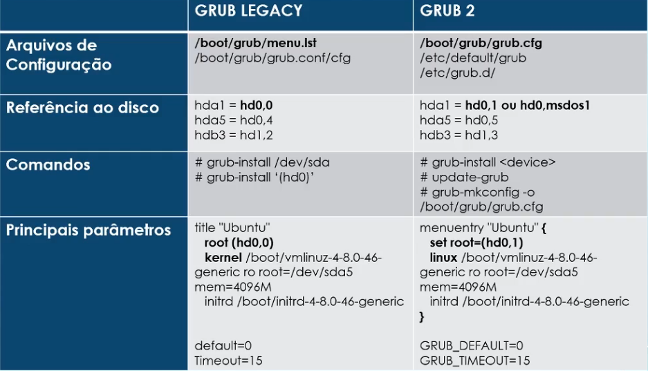

## 102.2 Instalação e Configuração do Boot Manager - GRUB Legacy e GRUB 2

Obs: No GRUB 2 o principal arquivo de configuração é o `/boot/grub/grub.cfg`, mas o administrador configura o arquivo `/etc/default/grub` e o diretório `/etc/grub.d/` as informações destes dois últimos são enviados pra o `grub.cfg` que é usado no boot do sistema. 
Para isso temos os comandos `update-grub`e `grub-mkconfig -o /boot/grub/grub.cfg` que são responsáveis por atualizar e aplicar as mudanças no `grub.cfg`.

## 102.2 Instalação e Configuração do Boot Manager - Interação com o GRUB

## 102.2 Instalação e Configuração do Boot Manager - GRUB - COnfiguraçãoes e Comandos

### 102.2 Exercícios