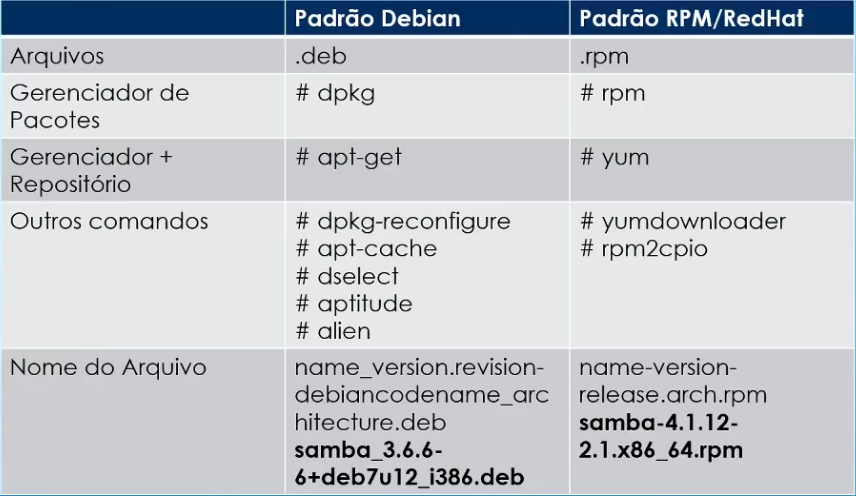

## Gerenciamento de Pacotes Debian = Debian x RPM, comando dpkg

**Diferenças entre Pacotes Debian e Pacotes Red Hat**


**Conceitos importantes**
* Cada sistema deve usar um sistema de gerenciamento único;
* Um pacote é um conjunto de arquivos relacionados a uma aplicação: executáveis, cfgs, bibliotecas, manuais, etc, além de informações sobre dependências;
* Os gerenciadores de pacotes mantém uma base de dados relacionando todos os pacotes, seus arquivos e dependências;

**DPKG**

* Não gerência dependências;

```shell
dpkg -l || dpkg --get-selections # lista os pacotes instalados
dpkg -l <pkg-name> # mostra informações do determinado pacote 
dpkg -I <pkg-name> # informações sobre o pacote
dpkg --contents <pkg-name> # lista os arquivos que tem dentro do pacote
dpkg -i <pkg-name> # instala o pacote
dpkg -L <pkg-name> # arquivos associado ao pacote que foram instalados
dpkg -s <pkg-name> # status do pacote instalado
dpkg -S <arquivo> # mostra qual o pacote que o arquivo pertence
dpkg -r <pkg-name> # desinstala o pacote (mas mantem informações e arquivos de configuração do mesmo)
dpkg -P <pkg-name> || dpkg --purge <pkg-name> # remove o pacote instalado e todos os arquivos pertencentes ao mesmo.
```