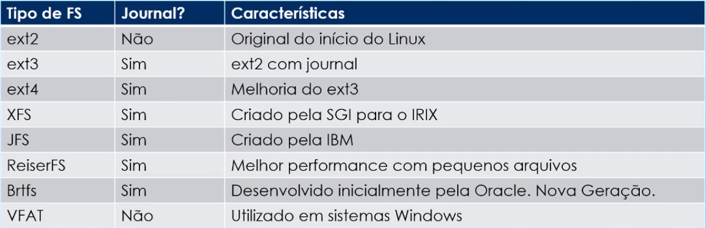

## 104.1 Criando Partições e Sistemas de Arquivos - fdisk

O comando `fdisk` é o principal comando para gerenciar partições no Linux.
O padrão é sempre criar discos com partição MBR.

```shell
fdisk -l # lista os discos e partições
fdisk /dev/sda # abre o fdisk no disco sda
```
Ao entrar no `fdisk` podemos usar diversos comando para fazer o gerenciamento do disco.

Opções:

```shell
m : lista todos os comandos disponíveis
n : adiciona uma nova partição
p : lista as partições
q : sai sem salvar
w : salva e sai
d : exclui uma partição
l : lista todos os tipos de partição disponíveis
t: altera o tipo da partição
o : cria uma nova tabela de partições (apaga tudo que foi definido anteriormente)
g : cria uma nova tabela de partições GPT
F : mostra o espaço livre
```

## 104.1 Criando Partições e Sistemas de Arquivos - gdisk

O `gdisk` é similiar ao `fdisk` mas trabalha exclusivamente com partições GPT.

As opções são as mesmas do `fdisk`.

## 104.1 Criando Partições e Sistemas de Arquivos - Tipo FS, mkfs, mkswap

O filesystem é a forma com que o Linux vai trabalhar os dados dentro do disco. Tamanho dos blocos, alocação, etc.

**Tipos de FileSystems:**



**Journal:** É uma habilidade do filesystem que permite a gravação de logs das operações feitas em disco.

**mkfs:**

O comando `mkfs` (make filesystem) é responsável por atribuir um FS à uma partição.

Uso:

```shell
mkfs -t <fs-type> <partition> || mkfs.<fs-type> <partition>
ex.: mkfs -t ext4 /dev/sda1   || mkfs.ext4 /dev/sda1
```

Para ver o forma da partição podemos usar o comando

```shell
file -s <partition>
ex.: file -s /dev/sda1
```

**mkswap:**

O `mkswap` formata a partição para ser usada como swap.

Uso:

```shell
mkswap <partition>
ex.: mkswap /dev/sda2
```

Para usar a partição como swap de fato usamos o comando `swapon`

```shell
swapon <partition>
ex.: swapon /dev/sda2
```

Para checar basta dar um `cat /proc/swaps`.

## 104.1 Criando Partições e Sistemas de Arquivos - parted, gparted

O comando `parted` é similiar ao `fdisk` mas contém mais opções, como por exemplo reparticionar uma partição.

Uso:

```shell
parted <disk-name>
ex.: parted /dev/sdb
```

Opções:

```shell
help : mostra a lista de comandos e funcionalidades
p : lista as partições
resizepart <partition-number> <end> # ex.: resizeparted 2 4000MB
quit : sai do parted
```

O programa `gparted` é o `parted` com interface gráfica.

## 104.1 Criando Partições e Sistemas de Arquivos - btrfs

**Características:**

* Btrfs - B-tree File System
* Filesystem moderno em constante desenvolvimento
* Foco em tolerância à falahas e facilidade de administração e reparo
* Desenvolvido por um grupo de empresas: Oracle, RedHat, Fujitsu, Intel, SUSE, Facebook, etc
* Usado pelo Facebook, TripAdvisor, OpenSUSE, etc

**Recursos:**
* Multi-Devices FileSystems / RAID
  * Suporta RAID 0, 1, 10 (5 e 6 em desenvolvimento)
* SubVolumes
  * Estrutura dentro de uma partição / volume
  * Pode ser montado separadamente
* Compressão Transparente
  * Compressão pode ser feita diretamente no FS
  * Algortimos zlib, LZO, ZSTD
* Snapshot
  * Foto de um sistema de arquivos
* Conversão de ext3 para btrfs

## 104.1 Criando Partições e Sistemas de Arquivos - exFAT

**Definição:**

* exFAT = Extended FAT, ou FAT64
* Sistema de arquivos otimizado para pen drives / flash drives e cartões de memória
* Sistema de arquivos padrão para os cartões SDXC maiores que 32GB

**Características:**

* Intermeduário entre o FAT e o NTFS
* Mais simples e leve que o NTFS
* Permite arquivos maiores que o FAT
* No FAT o limite por arquivo é 4GB, no exFAT é 16EB
* No Linux é implementados pelos pacotes exfat-fuse e exfat-utils

### 104.1 Exercícios

1. Adicione em sua máquina virtual um novo disco de 10 GB e crie o seguinte conjunto de partições utilizando o modelo MBR:

* /dev/sdX1 - 3G

* /dev/sdX3 - 2G

* /dev/sdX4 - O restante do disco

* /dev/sdX5 - 500M

* /dev/sdX6 - 1500M

* /dev/sdX7 - 2G

```shell
fdisk /dev/sdX
n
1
<enter>
+3G

n
3
<enter>
+2G

n
4
<enter>

n
5
<enter>
+500M

n
6
<enter>
+1500M

n
7
<enter>
+2G
```

2. Redimensione a partição de número 7 para que ela tenha o tamanho de 3G ao invés de 2G.

```shell
parted /dev/sdX
resizeparted 7 <end-partition>
```

3. Defina a partição sdX5 para que ela seja utilizada na área de swap.

```shell
mkswap /dev/sdX5
```

4. Formate as partições 1 e 3 como ext4, a partição 6 como XFS e a 7 como Btrfs.

```shell
mkfs.ext4 /dev/sdX1
mkfs.ext4 /dev/sdX3
mkfs.xfs /dev/sdX6 # pacote xfsprogs
mkfs.btrfs /dev/sdX7 # pacote btrfs-toos (deb) btrfs-progs (RHEL)
```